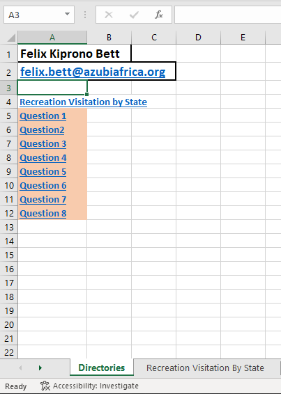

# **EXCEL DATA VISUALIZATION**

# Introduction
National Park Services (NPS) is a federal agency of the United States government responsible for managing all U.S. national parks, many American national monuments, and other conservation and historical properties

# Project Requirements
You are employed as a data analyst by NPS to help them gain insights into their data. Use the data file provided in Excel to answer the following questions:

1. How many people visited different parks in Colorado state?
2. Justify the choice of your Chart in question 1
3. Which of the states recorded the most visitors?
4. Justify the choice of your Chart in question 3
5. Which park in California recorded the least percentage of visitors?
6. With the aid of a chart, what is the mean value of all visitors?
7. Create ONE chart showing the visitor trend over the years for Boston African American Park.
In your own words, please describe the trend according to the chart you created.
8. Create a different worksheet named as Maps and plot all the states against their total number of visitors on a graph.

## Gaining insights into National Park Services (NPS) data

For each question;
- Grab (copy) all the necessary data from the table named "Recreation Visitation By State and by Park for Year: 2016"
- Paste into a new worksheet, each copied data for each question, within your current workbook
- Sort the data in the new tables in each worksheet by number of Recreation Visitors in ascending or descending order if necessary (i.e., If your visualizations require the data to be in a certain order)
- Choose an appropriate chart for each question to visualize the data in each worksheet

For further reading on choosing the appropriate chart see;
[*Data Visualization 101: How to Choose a Chart Type*](https://towardsdatascience.com/data-visualization-101-how-to-choose-a-chart-type-9b8830e558d6)

After visualizing your data;
- Provide complete and accurate answer(s) within the each worksheet with the tables and charts to the question handled
- Provide complete and accurate answer(s) to each justification questions
- Include appropriate and meaningful chart elements (e.g., chart titles, data labels, legend keys, etc.) without being too cluttered.
[*The Ultimate Guide To Excel Charts and Graphs*](https://www.businesscomputerskills.com/tutorials/excel/the-ultimate-guide-to-excel-charts-and-graphs.php)

- Each worksheet should have appropriate chart names.

**To easily navigate through the worksheets, create a directories worksheet as the first sheet of your workbook.**

Insert links within each directory to move back and forth between the Directory worksheet and every other worksheet within the workbook

[How to: *Work with links in Excel*](https://support.microsoft.com/en-us/office/work-with-links-in-excel-7fc80d8d-68f9-482f-ab01-584c44d72b3e)

[Click to watch video on how navigating through directories works](./pics_and_clips/Felix_Kiprono%20Bett%20-%20Excel%202022-12-05%2010-19-15.mp4)

## **Remark:**
## **`Open the .xlsx files using the default application (Microsoft Excel) to view and edit them`**

---